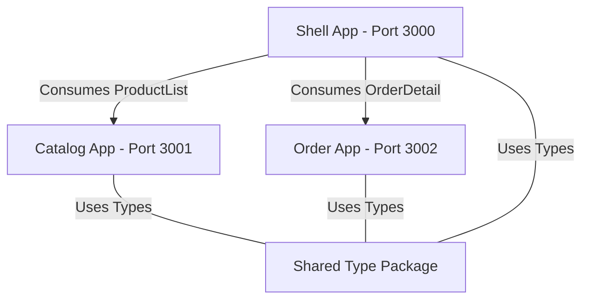

# 🌭 Sasa Micro-frontend Ecosystem

Selamat datang di ekosistem **Sasa Super App**. Proyek ini menggunakan arsitektur **Micro-frontend** berbasis **Next.js 15** dan **Module Federation (Webpack 5)** dengan manajemen **Monorepo (Workspaces)**.

## 🏗️ Arsitektur

Ekosistem ini terdiri dari satu aplikasi **Host**, dua aplikasi **Remote**, dan satu **Shared Package**:



- **Shell App (Port 3000)**: Portal utama yang mengintegrasikan modul Katalog dan Order.
- **Catalog App (Port 3001)**: Modul daftar produk sosis Sasa.
- **Order App (Port 3002)**: Modul ringkasan pesanan dan checkout.
- **Shared Package (@sasa/shared)**: Paket berisi definisi tipe TypeScript (Product) yang dibagikan ke seluruh aplikasi.

## 📂 Struktur Direktori (Monorepo)

```text
sasa-micro-frontend/
├── catalog-app/          # Remote: Katalog (Exposes ProductList)
├── order-app/            # Remote: Pesanan (Exposes OrderDetail)
├── shell-app/            # Host: Dashboard Utama (Consumes Remotes)
├── shared/               # Shared Package: @sasa/shared (Types Only)
├── package.json          # Root Package (Workspaces Configuration)
└── readme.md             # Dokumentasi Utama
```

## 🛠️ Tech Stack

- **Framework**: Next.js 15.1.0 (Pages Router)
- **UI & Styling**: React 19 + Tailwind CSS 4
- **Micro-frontend**: `@module-federation/nextjs-mf`
- **Monorepo**: NPM Workspaces
- **Language**: TypeScript

## 🚀 Cara Menjalankan

Langkah-langkah untuk menjalankan seluruh ekosistem:

1.  **Install Dependencies (Level Root)**:
    Buka terminal di folder root project dan jalankan sekali saja:
    ```bash
    npm install
    ```
    *Ini akan menginstal dependencies untuk semua aplikasi sekaligus dan melakukan linking pada folder `@sasa/shared`.*

2.  **Run Development Servers**:
    Buka 3 terminal terpisah atau jalankan terminal di setiap folder:
    - **Host (Shell)**: `cd shell-app && npm run dev` (Port 3000)
    - **Remote (Catalog)**: `cd catalog-app && npm run dev` (Port 3001)
    - **Remote (Order)**: `cd order-app && npm run dev` (Port 3002)

3.  **Akses**: Buka [http://localhost:3000](http://localhost:3000).

## 💡 Best Practices yang Diterapkan
- **Async Bootstrapping**: Mencegah error hook dispatcher pada Module Federation.
- **Single Source of Truth**: Semua tipe data produk dikelola di folder `shared`.
- **Tailwind 4 Source Scanning**: Memungkinkan host merender CSS dari remote component secara akurat.

## 📝 Kontribusi
1. Jika ingin mengubah tipe produk, ubah file `shared/index.ts`.
2. Jika menambah remote app baru, daftarkan di root `package.json` workspaces.
